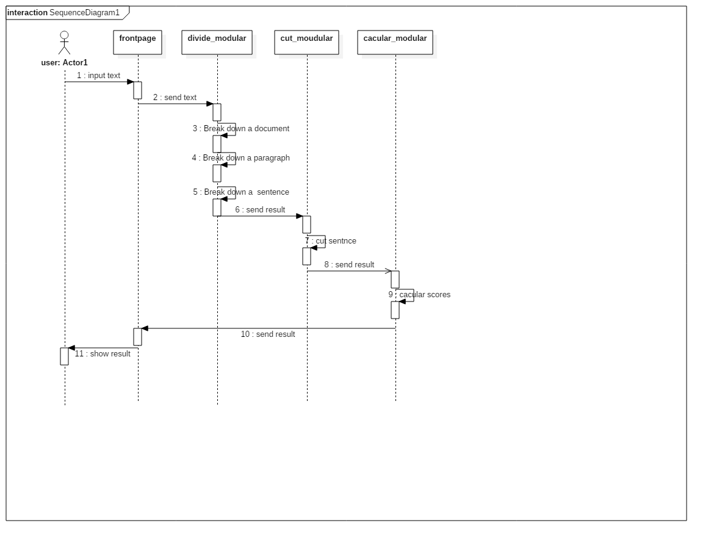
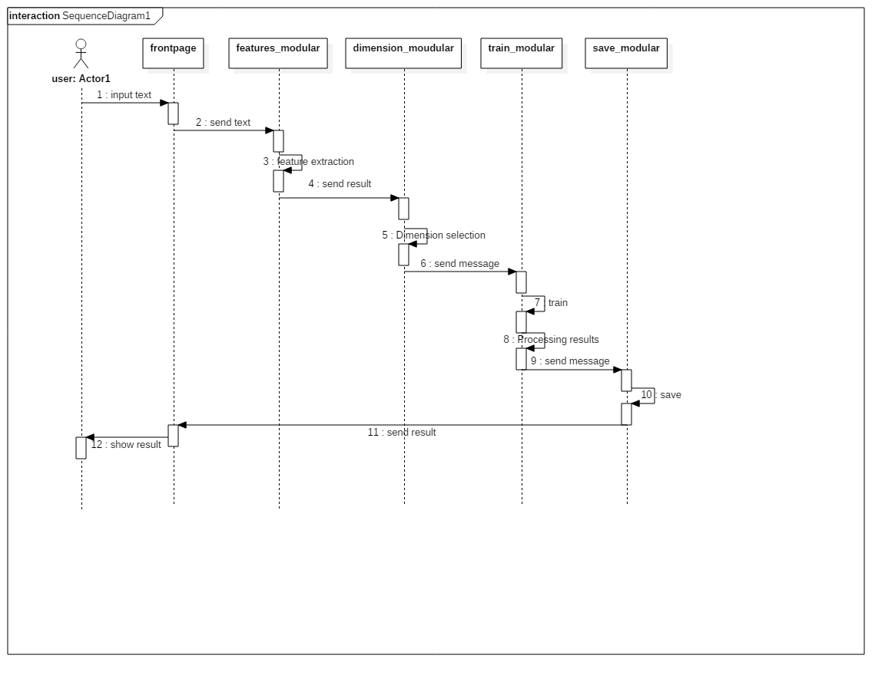
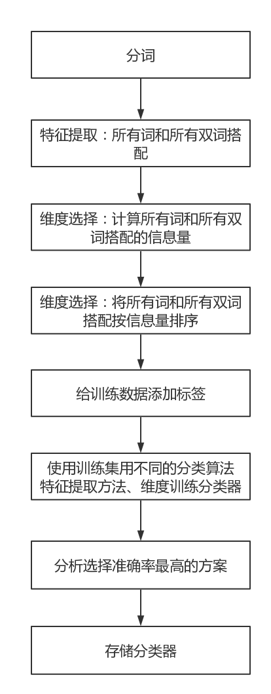
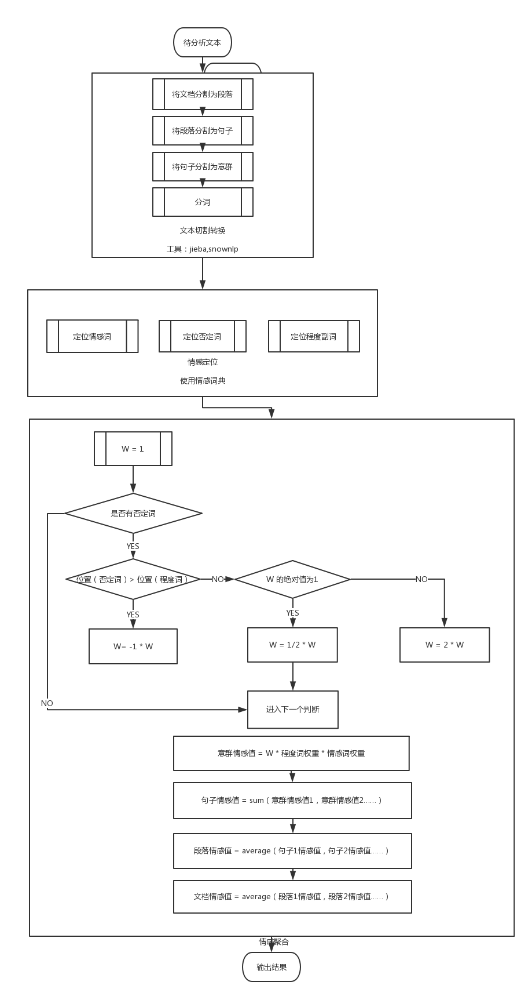

# 详细设计规约


## 背景

目前，情感倾向分析的方法主要分为两类：一种是基于情感词典的方法；一种是基于机器学习的方法，如基于大规模语料库的机器学习。前者需要用到标注好的情感词典，英文的词典有很多，中文主要有知网整理的情感词典Hownet和台湾大学整理发布的NTUSD两个情感词典，还有哈工大信息检索研究室开源的《同义词词林》可以用于情感词典的扩充。基于机器学习的方法则需要大量的人工标注的语料作为训练集，通过提取文本特征，构建分类器来实现情感的分类。

文本情感分析的分析粒度可以是词语、句子也可以是段落或篇章。段落篇章级情感分析主要是针对某个主题或事件进行倾向性判断，一般需要构建对应事件的情感词典，如电影评论的分析，需要构建电影行业自己的情感词典效果会比通用情感词典效果更好；也可以通过人工标注大量电影评论来构建分类器。句子级的情感分析大多事通过计算句子里包含的所有情感词的平均值来得到。

篇章级的情感分析，也可以通过聚合篇章中所有的句子的情感倾向来计算得出。因此，针对句子级的情感倾向分析，既能解决较短文本的情感分析，同时也可以是篇章级文本情感分析的基础。


## 过程流设计

* 使用情感词典方法的过程流 : 

  


* 使用机器学习方法的过程流: 

  


## 算法设计


### 机器学习算法设计

#### 背景

机器学习的方法精确度更高，因为词典匹配会由于语义表达的丰富性而出现很大误差，而机器学习方法不会。而且它可使用的场景更多样。无论是主客观分类还是正负面情感分类，机器学习都可以完成任务。而无需像词典匹配那样要深入到词语、句子、语法这些层面。

而词典方法适用的语料范围更广，无论是手机、电脑这些商品，还是书评、影评这些语料，都可以适用。但机器学习则极度依赖语料，把手机语料训练出来的的分类器拿去给书评分类，那是注定要失败的。

使用机器学习进行情感分析，可以换一个相同意思的说法，就是用有监督的（需要人工标注类别）机器学习方法来对文本进行分类。

这点与词典匹配有着本质的区别。词典匹配是直接计算文本中的情感词，得出它们的情感倾向分值。而机器学习方法的思路是先选出一部分表达积极情感的文本和一部分表达消极情感的文本，用机器学习方法进行训练，获得一个情感分类器。再通过这个情感分类器对所有文本进行积极和消极的二分分类。最终的分类可以为文本给出0或1这样的类别，也可以给出一个概率值，比如”这个文本的积极概率是90%，消极概率是10%“。

Python 有良好的程序包可以进行情感分类，那就是Python 自然语言处理包，Natural Language Toolkit ，简称NLTK 。同时Python 也有良好的程序包可以进行对中文文本进行分析，如jiaba。

#### 算法框架



#### 数据集

先以带有正向标签和负向标签的各1500条真实的中文酒店评论语料作为训练集用以训练分类器，剩余带有正向标签和负向标签的各500条真实的中文酒店评论语料作为测试集测试不同分类算法、不同特征提取方法、不同维度的准确度。

最后选择准确度最高的方案，将上述带有正向标签和负向标签的各2000条真实的中文酒店评论语料作为训练集训练最终存储的分类器。

保存用户输入的语句和反馈，定期挑拣出新增的训练数据以优化分类器。

#### 维度和权重

不同分类方法、不同征选取方法、不同维度得到的测试准确率如下表：

##### 以所有词为特征提取方法

| 分类算法               | 准确率   |
| ------------------ | ----- |
| BernoulliNB        | 0.704 |
| MultinomiaNB       | 0.864 |
| LogisticRegression | 0.836 |
| SVC                | 0.555 |
| LinearSVC          | 0.821 |
| NuSVC              | 0.843 |

##### 以所有双词搭配为特征提取方法

| 分类算法               | 准确率   |
| ------------------ | ----- |
| BernoulliNB        | 0.56  |
| MultinomiaNB       | 0.854 |
| LogisticRegression | 0.827 |
| SVC                | 0.513 |
| LinearSVC          | 0.814 |
| NuSVC              | 0.781 |

##### 以所有词和所有双词搭配为特征提取取方法

| 分类算法               | 准确率   |
| ------------------ | ----- |
| BernoulliNB        | 0.64  |
| MultinomiaNB       | 0.876 |
| LogisticRegression | 0.843 |
| SVC                | 0.536 |
| LinearSVC          | 0.846 |
| NuSVC              | 0.842 |

##### 以信息量丰富的所有词为特征提取取方法

| 分类算法\维度            | 500   | 1000  | 1500  | 2000  | 2500  | 3000  | 3500  | 4000  | 4500  | 5000  | 5500  | 6000  | 6500  | 7000  | 7500  | 8000  | 8500  | 9000  |
| ------------------ | ----- | ----- | ----- | ----- | ----- | ----- | ----- | ----- | ----- | ----- | ----- | ----- | ----- | ----- | ----- | ----- | ----- | ----- |
| BernoulliNB        | 0.801 | 0.778 | 0.773 | 0.771 | 0.767 | 0.772 | 0.785 | 0.779 | 0.774 | 0.756 | 0.745 | 0.745 | 0.745 | 0.745 | 0.753 | 0.75  | 0.749 | 0.748 |
| MultinomiaNB       | 0.857 | 0.863 | 0.864 | 0.869 | 0.866 | 0.869 | 0.87  | 0.877 | 0.872 | 0.875 | 0.877 | 0.877 | 0.877 | 0.877 | 0.877 | 0.877 | 0.874 | 0.874 |
| LogisticRegression | 0.827 | 0.832 | 0.825 | 0.836 | 0.832 | 0.834 | 0.838 | 0.84  | 0.837 | 0.839 | 0.837 | 0.837 | 0.837 | 0.837 | 0.84  | 0.837 | 0.838 | 0.838 |
| SVC                | 0.806 | 0.742 | 0.714 | 0.688 | 0.674 | 0.664 | 0.639 | 0.61  | 0.591 | 0.584 | 0.571 | 0.571 | 0.571 | 0.571 | 0.57  | 0.565 | 0.565 | 0.565 |
| LinearSVC          | 0.826 | 0.821 | 0.815 | 0.808 | 0.814 | 0.821 | 0.818 | 0.814 | 0.813 | 0.816 | 0.815 | 0.815 | 0.815 | 0.815 | 0.813 | 0.815 | 0.822 | 0.822 |
| NuSVC              | 0.831 | 0.835 | 0.837 | 0.845 | 0.844 | 0.844 | 0.843 | 0.846 | 0.844 | 0.844 | 0.847 | 0.847 | 0.847 | 0.847 | 0.845 | 0.843 | 0.845 | 0.843 |

#### 以信息量丰富的所有词和所有双词搭配为特征选取方法

| 分类算法\维度            | 500   | 1000  | 1500  | 2000  | 2500  | 3000  | 3500  | 4000  | 4500  | 5000  | 5500  | 6000  | 6500  | 7000  | 7500  | 8000  | 8500  | 9000  |
| ------------------ | ----- | ----- | ----- | ----- | ----- | ----- | ----- | ----- | ----- | ----- | ----- | ----- | ----- | ----- | ----- | ----- | ----- | ----- |
| BernoulliNB        | 0.798 | 0.773 | 0.775 | 0.769 | 0.772 | 0.777 | 0.784 | 0.776 | 0.767 | 0.76  | 0.747 | 0.747 | 0.747 | 0.747 | 0.75  | 0.759 | 0.759 | 0.759 |
| MultinomiaNB       | 0.854 | 0.863 | 0.867 | 0.871 | 0.871 | 0.874 | 0.874 | 0.874 | 0.874 | 0.876 | 0.876 | 0.876 | 0.876 | 0.876 | 0.877 | 0.873 | 0.873 | 0.873 |
| LogisticRegression | 0.828 | 0.831 | 0.829 | 0.834 | 0.834 | 0.832 | 0.834 | 0.834 | 0.834 | 0.839 | 0.837 | 0.837 | 0.837 | 0.837 | 0.836 | 0.835 | 0.835 | 0.835 |
| SVC                | 0.806 | 0.739 | 0.712 | 0.688 | 0.671 | 0.659 | 0.633 | 0.604 | 0.595 | 0.583 | 0.565 | 0.565 | 0.565 | 0.565 | 0.565 | 0.565 | 0.565 | 0.565 |
| LinearSVC          | 0.824 | 0.807 | 0.817 | 0.812 | 0.81  | 0.818 | 0.811 | 0.809 | 0.815 | 0.813 | 0.814 | 0.814 | 0.814 | 0.814 | 0.811 | 0.811 | 0.811 | 0.811 |
| NuSVC              | 0.829 | 0.84  | 0.835 | 0.84  | 0.844 | 0.844 | 0.846 | 0.846 | 0.845 | 0.849 | 0.852 | 0.852 | 0.852 | 0.852 | 0.853 | 0.855 | 0.855 | 0.855 |

#### 关键步骤

1. 利用python程序包中文分词工具python对语料进行分词。

   ```python
   for file_name in FileNames:
       full_file_name = os.path.join(FindPath, file_name)
       if 'utf8' in full_file_name:
           with open(full_file_name, 'r', encoding='utf-8') as pos_f:
               pos_text = pos_f.read()
               pos_text = ''.join(pos_text.split())
               # pos_text = re.sub(string.punctuation, "", pos_text)
               pos_text = re.sub("[\s+\.\!\/_,$%^*(+\"\']+|[+——！，。？、~@#￥%……&*（）～-]+", "", pos_text)
               pos_list = jieba.cut(pos_text, cut_all=False)
               pos_words.append(list(pos_list))
   ```

2. 特征提取方法

   1.  把所有词作为特征

      ```python
      def bag_of_words(words):
          return dict([(word, True) for word in words])
      ```

   2. 把双词搭配作为特征

      ```python
      def bigram(words, score_fn=BigramAssocMeasures.chi_sq, n=1000):

          bigram_finder = BigramCollocationFinder.from_words(words)  # 把文本变成双词搭配的形式
          bigrams = bigram_finder.nbest(score_fn, n)  # 使用了卡方统计的方法，选择排名前1000的双词

          return bag_of_words(bigrams)
      ```

   3. 把所有词和双词搭配一起作为特征

      ```Python
      def bigram_words(words, score_fn=BigramAssocMeasures.chi_sq, n=1000):

          tuple_words = []
          for i in words:
              temp = (i,)
              tuple_words.append(temp)

          bigram_finder = BigramCollocationFinder.from_words(words)
          bigrams = bigram_finder.nbest(score_fn, n) # 使用了卡方统计的方法，选择排名前n的双

          return bag_of_words(tuple_words + bigrams)  # 所有词和（信息量大的）双词搭配一起作为特征
      ```

3. 特征选择方法

   1.  计算整个语料里面所有的信息量

      ```python
      def create_word_scores():
          posWords = pickle.load(open(pos_f, 'rb'))
          negWords = pickle.load(open(neg_f, 'rb'))

          posWords = list(itertools.chain(*posWords))  # 把多维数组解链成一维数组
          negWords = list(itertools.chain(*negWords))  # 同理

          word_fd = FreqDist()  # 可统计所有词的词频
          cond_word_fd = ConditionalFreqDist()  # 可统计积极文本中的词频和消极文本中的词
          for word in posWords:
              word_fd[word] += 1
              cond_word_fd["pos"][word] += 1
          for word in negWords:
              word_fd[word] += 1
              cond_word_fd["neg"][word] += 1

          pos_word_count = cond_word_fd['pos'].N()  # 积极词的数量
          neg_word_count = cond_word_fd['neg'].N()  # 消极词的数量
          total_word_count = pos_word_count + neg_word_count

          word_scores = {}
          for word, freq in word_fd.items():
              pos_score = BigramAssocMeasures.chi_sq(cond_word_fd['pos'][word], (freq, pos_word_count),
                                                     total_word_count)  # 计算积极词的卡方统计量，这里也可以计算互信息等其它统计量
              neg_score = BigramAssocMeasures.chi_sq(cond_word_fd['neg'][word], (freq, neg_word_count),
                                                     total_word_count)  # 同理
              word_scores[word] = pos_score + neg_score  # 一个词的信息量等于积极卡方统计量加上消极卡方统计量

          return word_scores  # 包括了每个词和这个词的信息量
      ```

   2. 计算整个语料里面所有词和双词搭配的信息量

      ```Python
      def create_word_bigram_scores():
          posdata = pickle.load(open(pos_f, 'rb'))
          negdata = pickle.load(open(neg_f, 'rb'))

          posWords = list(itertools.chain(*posdata))
          negWords = list(itertools.chain(*negdata))

          bigram_finder = BigramCollocationFinder.from_words(posWords)
          posBigrams = bigram_finder.nbest(BigramAssocMeasures.chi_sq, 5000)
          bigram_finder = BigramCollocationFinder.from_words(negWords)
          negBigrams = bigram_finder.nbest(BigramAssocMeasures.chi_sq, 5000)

          pos = posWords + posBigrams  # 词和双词搭配
          neg = negWords + negBigrams

          word_fd = FreqDist()
          cond_word_fd = ConditionalFreqDist()
          for word in pos:
              word_fd[word] += 1
              cond_word_fd["pos"][word] += 1
          for word in neg:
              word_fd[word] += 1
              cond_word_fd["neg"][word] += 1

          pos_word_count = cond_word_fd['pos'].N()
          neg_word_count = cond_word_fd['neg'].N()
          total_word_count = pos_word_count + neg_word_count

          word_scores = {}
          for word, freq in word_fd.items():
              pos_score = BigramAssocMeasures.chi_sq(cond_word_fd['pos'][word], (freq, pos_word_count), total_word_count)  # 计算积极词的卡方统计量，这里也可以计算互信息等其它统计量
              neg_score = BigramAssocMeasures.chi_sq(cond_word_fd['neg'][word], (freq, neg_word_count), total_word_count)
              word_scores[word] = pos_score + neg_score

          return word_scores
      ```

   3. 根据信息量进行倒序排序，选择排名靠前的信息量的词

      ```Python
      def find_best_words(word_scores, number):
          best_vals = sorted(word_scores.items(), key=lambda w_s: w_s[1], reverse=True)[:number]  # 把词按信息量倒序排序。number是特征的维度，是可以不断调整直至最优的
          best_words = set([w for w, s in best_vals])
          return best_words
      ```

   4. 把选出的这些词作为特征（这就是选择了信息量丰富的特征）

      ```python
      def best_word_features(words):
          # load_data()
          # word_scores = create_word_bigram_scores()
          global best_words
          # best_words = find_best_words(word_scores, 7500)
          return dict([(word, True) for word in words if word in best_words])
      ```

4. 分割数据及赋予类标签

   ```python
   # 积极
   def pos_features(feature_extraction_method):
       posFeatures = []
       for i in pos_review:
           posWords = [feature_extraction_method(i), 'pos']  # 为积极文本赋予"pos"
           posFeatures.append(posWords)
       return posFeatures
   ```


   # 消极
   def neg_features(feature_extraction_method):

       negFeatures = []
       for j in neg_review:
           negWords = [feature_extraction_method(j), 'neg']  # 为消极文本赋予"neg"
           negFeatures.append(negWords)
       return negFeatures
   ```

5. 使用训练集用不同的分类算法训练分类器，用分类器对开发测试集里面的数据进行分类，给出分类预测的标签，对比分类标签和人工标注的差异，计算出准确度

   ```python
   def score(classifier):
       classifier = nltk.SklearnClassifier(classifier)  # 在nltk 中使用scikit-learn的接口
       classifier.train(train)  #训练分类器

       pred = classifier.classify_many(dev)  # 对开发测试集的数据进行分类，给出预测的标签
       return accuracy_score(tag_dev, pred)  # 对比分类预测结果和人工标注的正确结果，给出分类器准确度


   def try_diffirent_classifiers():

       results = list()
       results.append(score(BernoulliNB()))
       results.append(score(MultinomialNB()))
       results.append(score(LogisticRegression()))
       results.append(score(SVC()))
       results.append(score(LinearSVC()))
       results.append(score(NuSVC()))

       return results
   ```

6. 选择准确度最高的分类算法、特征提取方法、维度得到的分类器并存储

   ```python
   def store_classifier():
       load_data()
       word_scores = create_word_bigram_scores()
       global best_words
       best_words = find_best_words(word_scores, 7500)

       posFeatures = pos_features(best_word_features)
       negFeatures = neg_features(best_word_features)

       trainSet = posFeatures + negFeatures

       MultinomialNB_classifier = SklearnClassifier(MultinomialNB())
       MultinomialNB_classifier.train(trainSet)
       pickle.dump(MultinomialNB_classifier, open('../out/classifier.pkl', 'wb'))
   ```

   ​


## 情感词典算法

我们已知: 

* 中文文本以字符串的方式传进系统
* 段落与段落之间使用换行符来划分
* 句子之间以 " 。，？！" 来划分
* 短句子，短句子之间以 “ ， ” 来划分

#### 基本思想

* 一个中文文本的情感值由构成它的所有的段落的情感值所决定
* 一个段落的情感值由构成它的所有的长句子决定
* 一个长句子的情感值由构成它的所有短句子的情感值决定
* 一个短句子的情感值由构成它的所有词语的情感值决定
* 将组成一个短句子的所有词语的情感值查找出来, 记录于一个列表中, 将一定的算法施加于这个列表, 得到短句子的情感值
* 将组成一个长句子的所有短句子的情感值记录于一个列表中, 将一定的算法施加于这个列表, 得到长句子的情感值
* 将组成一个段落的所有长句子的情感值记录于一个列表中,  将一定的算法施加于这个列表,  得到段落的情感值
* 将组成一个篇章的所有段落的情感值记录于一个列表中,  将一定的算法施加于这个列表,  得到篇章的情感值


#### 算法流程: 

1. 将一个中文文本转换为一个有短句子字符串组成列表
2. 对每一个短句子字符串进行如下操作：
   1. 使用 jieba 分词系统将一个短句子转换成 词语, 词性对 的列表
   2. 使用词语的词性筛选出潜在的情感词语, 
   3. 在已有的情感词典中查找这些潜在的情感词语
   4. 所查找的情感词语的情感词语分类 以及 它的情感值组合成一个词典并记录到一个列表中
   5. 使用相应的算法处理这个列表, 得出这个小句子的情感极值
3. 将一个中文文本中的所有短句子的情感极值记录在一个列表中
4. 使用相应的算法处理这个列表, 得出整个中文文本的情感极值




#### 算法特性

1. 算法准确率基于分词的准确率, 以及情感词典的准确率
2. 对句式简单的句子的识别准确率高
3. 对复杂句子的分析依赖于复杂的文本处理算法 


#### 关键代码

1. 加载情感词典

   ```
   #-----------------------------------------------------------------------
   #   初始化词典 , 加载自定义jieba词典
   #   para_in : dic_kind 词典类型
   #             1.    知网
   #             2.    大连理工
   #             3.    NTUSD
   #             4.    清华李建军
   #             5.    清华情感词极值词典
   #             else  None
   #   para_out: 无
   #-----------------------------------------------------------------------
   def __init_dic__(dic_kind):
       global ext_dic
       jieba.load_userdict(dic_root_path + 'create_by_huzehao/jieba_dic.txt')
       __path__ = dic_root_path + "zhiwang\\"
       ext_dic = Modules.load_dic.load_ext_dic(__path__, "extent_Lv_")  # 初始化程度副词词典
       __init__no_word_list()
       if dic_kind == 1:               #知网
           __init_zhiwang_dic__()
       elif dic_kind == 2:             #大连理工
           __init_dllg_dic__()
       elif dic_kind == 3:             #NTUSD
           __init_ntusd_dic__()
       elif dic_kind == 4:             #清华大学 李建军
           __init_tsinghua_dic__()
       elif dic_kind == 5:             #情感极值词典
           __init_extreme_dic__()
       else:
           return None
   ```


2. 得出词语详细信息

   ```   
   #-----------------------------------------------------------------------
   #给出一个中文词语, 及其词性, 返回一个字典, 里面包含 词语 词性 分数 情感词类型
   #   eg: {'n': '恶劣', 'k': 'a', 's': -1, 'p': 'neg'}
   #         n:词语名     k: 词性   s:分数    p: 属性
   #   para_in :  word       词语
   #   para_in :  kind       词性
   #   para_in :  dic_kind   字典类型
   #   para_in :  All        是否为全模式(默认为False)
   #                         True   :对所有传入的词语均返回一个详细信息
   #                         False  :只对词性在 sense_word_kind_set 里的词返回一个详细信息
   #   para_out:  dic        描述一个词语的详细信息
   #-----------------------------------------------------------------------
   def find_word_info(word, kind, dic_kind, All = True):
       dic = {}
       def __setdic__(k, s, p = None):
           dic['n'] = word                   #word
           dic['k'] = k                      #kind
           dic['s'] = s                      #score
           dic['p'] = p                      #property

       def __common__(pos_dic, neg_dic):     #如果词语是正面情感词或负面情感词的时候, 进行该操作
           score = __getScore__(pos_dic, word)
           if score != 0:
               __setdic__(kind, score, 'pos')
           else:
               score = __getScore__(neg_dic, word)
               if score != 0:
                   __setdic__(kind, score, 'neg')
               else:  # 有意义的词被遗漏了
                   __setdic__(kind, score)
                   ignoredWordList.write("{} {} {}\n".format(word, kind, score))

       if word in no_word_set:
           __setdic__('no', None, None)
       elif  kind in sense_word_kind_set:
           score =  __getScore__(ext_dic, word)
           if score != 0:
               __setdic__(kind, score, 'ext')
           else:
               if dic_kind == 1:       #知网
                   __common__(zhiwang_pos_sen_dic, zhiwang_neg_sen_dic)

               elif dic_kind == 2:     #大连理工
                   pass

               elif dic_kind == 3:     #ntusd
                   __common__(ntusd_pos_dic,ntusd_neg_dic)

               elif dic_kind == 4:     #清华 李建军
                   __common__(tsinghua_pos_dic, tsinghua_neg_dic)

               elif dic_kind == 5:     #情感极值词典
                   score = __getScore__(word_extreme_dic, word)
                   if score > 0:
                       __setdic__(kind, score, "pos")
                   elif score < 0:
                       __setdic__(kind, score, "neg")
                   else:              #情感词语遗漏了
                       ignoredWordList.write("{} {} {}\n".format(word, kind, score))

       if len(dic) > 0:
           return dic
       elif All:
           __setdic__(kind, 0, None)
           return dic
       else: return None

   ```

3. 计算短句子情感值

   ```
   #-----------------------------------------------------------------------
   #   para_in :tiny_sentence
   #   para_in :
   #	para_in : 
   #   para_out: score
   #-----------------------------------------------------------------------
   def _get_group_score(tiny_sentence,group = [{}], stream = None):
       if len(group) > 0:
           stack = []
           score = None
           score_item = None
           pair = getCommentPair(tiny_sentence,group)
           if pair != None:
               score_item = conn.execute('select s from polysemy where a = ? and n = ?', pair).fetchone()
               if score_item != None:
                   score = score_item[0]
                   stack.append(score)
                   for item in group:
                       if item.get('k') == 'no':
                           stack.append(-1)
                       elif item.get('k') == 'ext':
                           stack.append(item.get('s'))
                   return  __CaculateScoreOfGroup__(stack, False), stack, pair
           #else:
           score, stack = get_group_score(group)
           return score, stack, pair
       return 0, None
   ```

4. 获取整个中文文本的情感值

   ```
   #-----------------------------------------------------------------------
   #                               暴露接口
   #   para_in : text      文件内容    字符串
   #   para_in : dic_kind  词典类型    整数值
   #             1: 知网
   #             2: 大连理工
   #             3: ntusd
   #             4:李建军
   #             5:极值词典
   #   para_out: score     文本情感值
   #-----------------------------------------------------------------------
   def getScoreFromString(text, dic_kind):
       __init_dic__(dic_kind)
       pgen = get_paragraph(text)
       ggen = get_group(pgen)
       _score_sum_ = 0
       if dic_kind == 4:
           _score_sum_ = _text_processing_(text)
       else:
           for group in ggen:
               wordList = splict_group_into_list(group, dic_kind)
               score, stack = _get_group_score(wordList)
               _score_sum_ += score
               #print(group, score, stack, wordList)
       return _score_sum_
   ```

   ​

#### 使用词典

* 大连理工情感词典
* 台湾大学NTUSD情感词典
* 清华大学李中军情感词典
* 知网Hownet情感词典
* 否定词词典
* 程度副词词典


### 测试语料

* 谭松波--酒店评论语料

### 测试结果

|             | 负    | 正    | 零    | 准确率   |
| ----------- | ---- | ---- | ---- | ----- |
| 1000条负向情感文本 | 742  | 182  | 73   | 74.2% |
| 3000条负向情感   | 2145 | 607  | 248  | 71.5% |
| 1000条正向情感文本 | 158  | 745  | 97   | 74.5% |


## 类设计


------


### TestSample

**测试样例** 

- class TestSample

#### Fields

| Field             | Description |
| ----------------- | ----------- |
| _id               | 测试样例的ID     |
| _text             | 测试样例的文本     |
| _emotion_extremum | 测试样例的情感极值   |

#### 构造函数

> def __ init __ (self, id, text, emotion_extremum)

通过 id, text, emotion_extremum 来构造一个测试样例

**参数** 

* _id 
* _text
* _emotion_extremum

#### 方法

> getId

* def getId()

获取测试样例的ID

**returns**

* 测试样例的id

**parameters**

none

**throws**

GeneralExpection


> getId

* def getId(id)

给测试样例设置id

**returns**

* none

**parameters**

* id

**throws**

GeneralExpection


> getText

* def getText()
* 获取测试样例的中文文本

**returns**

* none

**parameters**

* none

**throws**

* GeneralExpection


> setText

* def setText()

设置测试样例的文本

**returns**

* none

**parameters**

* text

**throws**

* GeneralExpection


> getEmotionExtremum()

* def getEmotionExtremum()

获取测试样例的情感极值

**returns**

* _emotion_extremum

**parameters**

* none

**throws**

* GeneralExpection


> setEmotionExtremum()

* def setEmotionExtremum(extremum)

设置测试样例的情感极值

**returns**

* none

**parameters**

* extremum

**throws**

GeneralExpection


### WaitingSample

**测试样例** 

* class WaitingSample(TestSample)

继承于TestSample

#### Fields

| Field             | Description |
| ----------------- | ----------- |
| _id               | 测试样例的ID     |
| _text             | 测试样例的文本     |
| _emotion_extremum | 测试样例的情感极值   |
| _verify_result    | 审核结果        |

#### 构造函数

> def __ init __ (self, id, text, emotion_extremum, check_result)

通过 id, text, emotion_extremum,check_result 来构造一个测试样例

**参数** 

* id 
* text
* emotion_extremum

#### 方法

> getId

* def getId()

获取测试样例的ID

**returns**

* 测试样例的id

**parameters**

none

**throws**

GeneralExpection


> getId

* def getId()

获取测试样例的ID

**returns**

* 测试样例的id

**parameters**

none

**throws**

GeneralExpection


> getId

* def getId(id)

给测试样例设置id

**returns**

* none

**parameters**

* id

**throws**

GeneralExpection


> getText

* def getText()
* 获取测试样例的中文文本

**returns**

* none

**parameters**

* none

**throws**

* GeneralExpection


> setText

* def setText()

设置测试样例的文本

**returns**

* none

**parameters**

* text

**throws**

* GeneralExpection


> getEmotionExtremum()

* def getEmotionExtremum()

获取测试样例的情感极值

**returns**

* _emotion_extremum

**parameters**

* none

**throws**

* GeneralExpection


> setEmotionExtremum()

* def setEmotionExtremum(extremum)

设置测试样例的情感极值

**returns**

* none

**parameters**

* extremum

**throws**

GeneralExpection


> getVerifyResult()

* def getVerifyResult()
* 获取审核结果

**returns**

* _verify_result

**parameters**

* none

**throws**

GeneralExpection


> setVerifyResult()

* def setVerifyResult(verify_result)
* 获取审核结果

**returns**

* none

**parameters**

* none

**throws**

GeneralExpection


### CorrectSample

**测试样例** 

* class CorrectSample(TestSample)

继承于TestSample

#### Fields

| Field             | Description |
| ----------------- | ----------- |
| _id               | 测试样例的ID     |
| _text             | 测试样例的文本     |
| _emotion_extremum | 测试样例的情感极值   |
| _test_result      | 测试结果        |

#### 构造函数

> def __ init __ (self, id, text, emotion_extremum, test_result)

通过 id, text, emotion_extremum, test_result 来构造一个测试样例

**参数** 

* _id 
* _text
* _emotion_extremum
* _test_result

#### 方法

> getId

* def getId()

获取测试样例的ID

**returns**

* _id

**parameters**

none

**throws**

GeneralExpection


> getText

* def getText()

获取测试样例的文本

**returns**

* _text

**parameters**

* none

**throws**

* GeneralExpection


> getEmotionExtremum()

* def getEmotionExtremum()

获取测试样例的情感极值

**returns**

emotion_extremum

**parameters**

none

**throws**

GeneralExpection


> getTestResult()

* def getTestResult()

获取测试结果

**returns**

* _test_result

**parameters**

* none

**throws**

* GeneralExpection


### EffectiveSample

**测试样例** 

* class EffectiveSample(TestSample)

继承于TestSample

#### Fields

| Field              | Description |
| ------------------ | ----------- |
| _id                | 测试样例的ID     |
| _text              | 测试样例的文本     |
| _emotion_extremum  | 测试样例的情感极值   |
| _error_type        | 程序出错原因      |
| _error_information | 测试时的中间信息    |

#### 构造函数

> def __ init __ (self, id, text, emotion_extremum, error_type, error_information)

通过 id, text, emotion_extremum, test_result, error_type, error_information来构造一个测试样例

**参数** 

* _id 
* _text
* _emotion_extremum
* _error_type
* _error_information

#### 方法

> getId

* def getId()

获取测试样例的ID

**returns**

* 测试样例的id

**parameters**

none

**throws**

GeneralExpection


> getText

* def getText()

Get the student name.

**returns**

the student name

**parameters**

none

**throws**

GeneralExpection


> getEmotionExtremum()

* def getEmotionExtremum()

获取测试样例的情感极值

**returns**

emotion_extremum

**parameters**

none

**throws**

GeneralExpection


> getTestResult()

* def getTestResult()

获取审核结果

**returns**

check_result

**parameters**

none

**throws**

GeneralExpection


> getErrorType()

* def getErrorType()

获取审核结果

**returns**

check_result

**parameters**

none

**throws**

GeneralExpection


> setErrorType()

* def setErrorType(error_type)

获取审核结果

**returns**

error_type

**parameters**

* ​

**throws**

GeneralExpection


